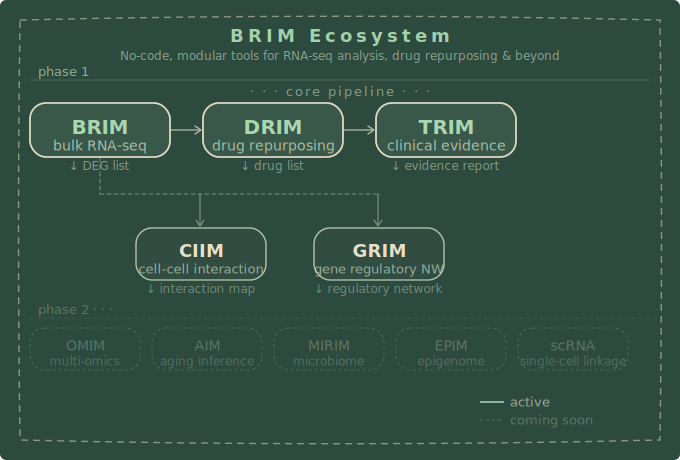
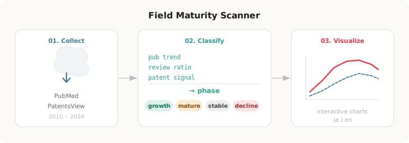

## Moki

Postdoc at Itch research center

---

## Ecosystem

## Ecosystem Tools

| Repository | Description |
|---|---|
| [bulk-rnaseq-analyzer-demo](https://github.com/mokimoki-22/bulk-rnaseq-analyzer-demo) | Bulk RNA-seq · DEG, GSEA, TF activity, cell-type scoring |
| [slim-scrna-analyzer](https://github.com/mokimoki-22/slim-scrna-analyzer) | No-code single-cell RNA-seq analysis |
| [trim-trajectory-analyzer](https://github.com/mokimoki-22/trim-trajectory-analyzer) | Single-cell trajectory analysis |
| [sprim-spatial-analyzer](https://github.com/mokimoki-22/sprim-spatial-analyzer) | Spatial transcriptomics · no-code |
## Other Research Tools

---

| Repository | Description |
|---|---|
| [field-maturity-scanner](https://github.com/mokimoki-22/field-maturity-scanner) | Research field maturity via publication trends & patent signals |
---

